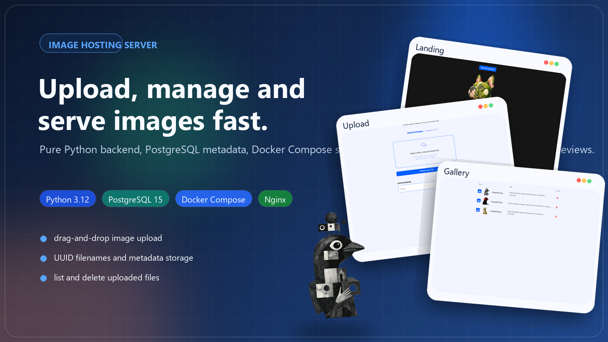
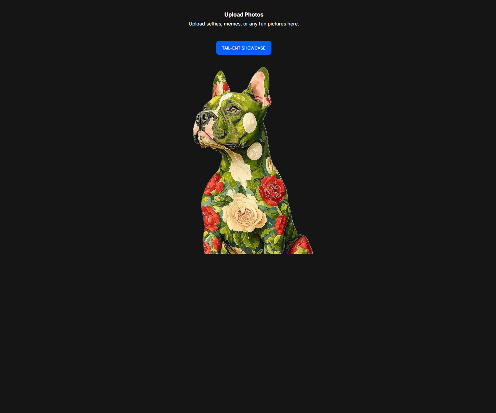
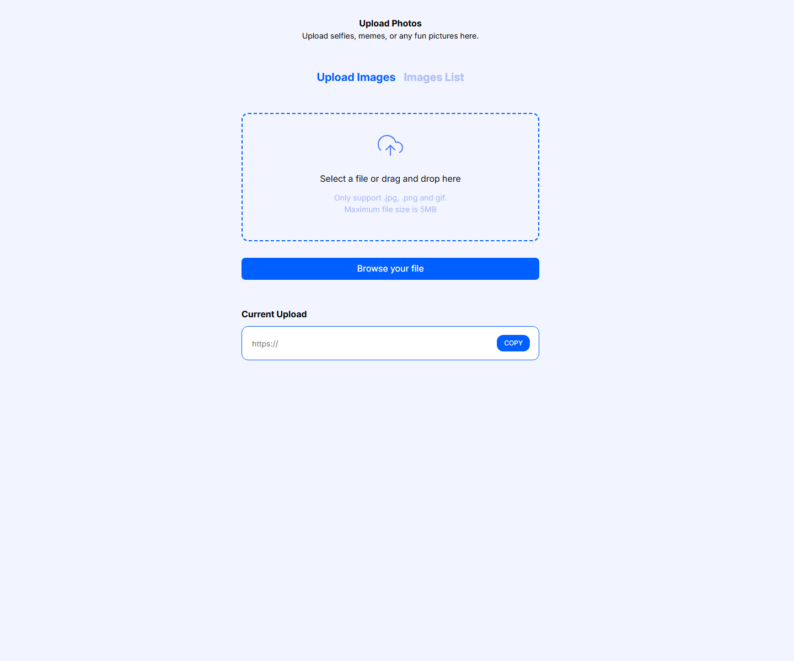
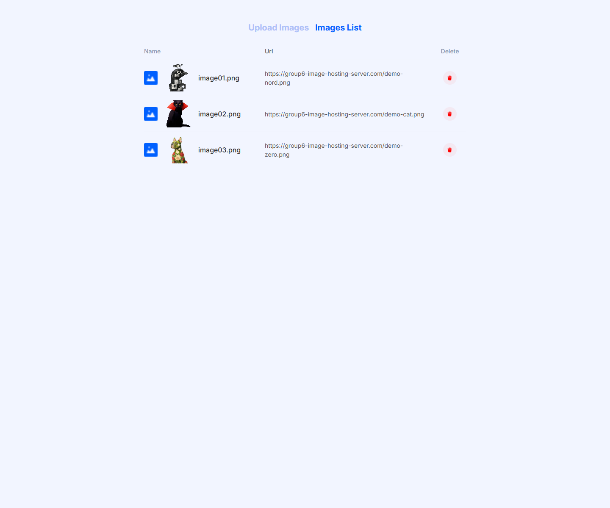

<p align="center">
  
</p>

# Image Hosting Server v2


A lightweight image hosting service built with pure Python, PostgreSQL, Docker Compose, and Nginx. The project provides a browser-based UI for uploading images, stores metadata in PostgreSQL, and lets users browse and delete uploaded files.

## Overview

This project combines a minimal Python HTTP server with a small frontend and containerized infrastructure:

- the backend accepts image uploads and validates file type and size
- uploaded files receive unique UUID-based names
- image metadata is stored in PostgreSQL
- Nginx proxies the app and serves static assets
- a backup script can create, list, and restore PostgreSQL dumps

## Quick Start

For the fastest setup, use Docker Compose:

1. Create `.env` from `.env.example`.
2. Set Docker-friendly values such as `DB_HOST=db` and `DB_PORT=5432`.
3. Start the project:

```bash
docker compose up --build
```

4. Open `http://localhost:8080`.

## Screenshots

The gallery preview below shows example items to demonstrate the interface layout.

<table>
  <tr>
    <td width="50%">
      <strong>Landing Page</strong><br>
      
    </td>
    <td width="50%">
      <strong>Upload Page</strong><br>
      
    </td>
  </tr>
  <tr>
    <td colspan="2">
      <strong>Images List</strong><br>
      
    </td>
  </tr>
</table>

## Features

- Drag-and-drop uploads and file picker support
- Validation for `jpg`, `jpeg`, `png`, and `gif`
- Maximum file size of `5 MB`
- UUID-based filenames to avoid collisions
- Paginated image listing from PostgreSQL
- Image deletion through the UI and API
- Docker Compose setup for app, database, and reverse proxy
- PostgreSQL backup and restore script

## Tech Stack

| Layer | Technology |
| --- | --- |
| Backend | Python 3.12, `http.server`, `socketserver` |
| Database | PostgreSQL 15 |
| Reverse proxy | Nginx |
| Containers | Docker Compose |
| Python packages | `pillow`, `psycopg2-binary`, `python-dotenv` |

## Service Map

| Service | Port | Purpose |
| --- | --- | --- |
| `db` | `5433 -> 5432` | PostgreSQL database |
| `app` | `8000` | Python HTTP server |
| `nginx` | `8080` | Recommended entrypoint, serves `/static/` and `/images/` |

## Project Structure

```text
.
|-- config/
|   |-- init.sql
|   `-- nginx.conf
|-- scripts/
|   `-- backup.py
|-- src/
|   |-- app.py
|   |-- database.py
|   |-- file_handler.py
|   |-- validators.py
|   |-- static/
|   `-- templates/
|-- backups/
|-- images/
|-- compose.yaml
|-- Dockerfile
|-- requirements.txt
`-- README.md
```

## Request Flow

1. A browser sends a `multipart/form-data` request to `POST /upload`.
2. The server validates file extension and file size.
3. The image is saved with a generated UUID filename.
4. Metadata is inserted into the `images` table in PostgreSQL.
5. The UI reads image records from `GET /api/images?page=1`.
6. Deletion removes both the database record and the stored file.

## Environment Variables

Create a `.env` file based on `.env.example`.

| Variable | Description | Example |
| --- | --- | --- |
| `DB_HOST` | PostgreSQL host used by the app | `db` |
| `DB_NAME` | Database name | `image_hosting` |
| `DB_USER` | Database user | `postgres` |
| `DB_PASSWORD` | Database password | `postgres` |
| `DB_PORT` | PostgreSQL port used by the app | `5432` |
| `PORT` | HTTP port for the Python app | `8000` |
| `POSTGRES_DB` | Database name for the PostgreSQL container | `${DB_NAME}` |
| `POSTGRES_USER` | PostgreSQL container user | `${DB_USER}` |
| `POSTGRES_PASSWORD` | PostgreSQL container password | `${DB_PASSWORD}` |

## Prerequisites

Choose one of the following workflows:

- Docker workflow: Docker Engine and Docker Compose
- Local workflow: Python 3.12 and PostgreSQL
- Optional: `curl` or Postman for testing API endpoints

Example Docker-friendly `.env`:

```env
DB_HOST=db
DB_NAME=image_hosting
DB_USER=postgres
DB_PASSWORD=postgres
DB_PORT=5432
PORT=8000

POSTGRES_DB=${DB_NAME}
POSTGRES_USER=${DB_USER}
POSTGRES_PASSWORD=${DB_PASSWORD}
```

## Run with Docker

1. Copy `.env.example` to `.env` and fill in the values.
2. Start the stack:

```bash
docker compose up --build
```

3. Open the services:

- `http://localhost:8080` - recommended entrypoint through Nginx
- `http://localhost:8000` - app directly
- `localhost:5433` - PostgreSQL exposed on the host

The database schema is initialized from `config/init.sql`, and PostgreSQL data is persisted in the `db_data` Docker volume.

To stop the stack:

```bash
docker compose down
```

To remove the database volume as well:

```bash
docker compose down -v
```

## Run Locally

1. Create and activate a virtual environment.
2. Install dependencies:

```bash
pip install -r requirements.txt
```

3. Create a PostgreSQL database manually.
4. Run the SQL schema from `config/init.sql`.
5. Configure `.env` for your local database, for example:

```env
DB_HOST=localhost
DB_NAME=image_hosting
DB_USER=postgres
DB_PASSWORD=postgres
DB_PORT=5432
PORT=8000
```

6. Start the server:

```bash
python src/app.py
```

7. Open:

- `http://localhost:8000`

Local mode note:

- uploaded image URLs in the current implementation are still returned as `https://group6-image-hosting-server.com/{filename}`
- the Python server does not expose `/images/...` directly; that route is handled by Nginx in the Docker setup

## Routes

### Pages

| Method | Route | Description |
| --- | --- | --- |
| `GET` | `/` | Landing page |
| `GET` | `/upload` | Upload page |
| `GET` | `/images-list` | Uploaded images list page |

### API

| Method | Route | Description |
| --- | --- | --- |
| `POST` | `/upload` | Upload an image using `multipart/form-data` |
| `GET` | `/api/images?page=1` | Get paginated image metadata |
| `DELETE` | `/api/images/{id}` | Delete an image and its metadata |

### Static and Media

| Method | Route | Description |
| --- | --- | --- |
| `GET` | `/static/...` | Frontend CSS, JS, and bundled images |
| `GET` | `/images/...` | Uploaded files served by Nginx in the Docker setup |

## API Examples

These examples use `curl`. In PowerShell, prefer `curl.exe` to avoid alias-related issues.

Upload an image:

```bash
curl.exe -X POST http://localhost:8000/upload -F "file=@example.jpg"
```

Get the first page of images:

```bash
curl.exe http://localhost:8000/api/images?page=1
```

Delete an image by id:

```bash
curl.exe -X DELETE http://localhost:8000/api/images/1
```

## Database Schema

```sql
CREATE TABLE IF NOT EXISTS images (
    id SERIAL PRIMARY KEY,
    filename TEXT NOT NULL,
    original_name TEXT NOT NULL,
    size INTEGER NOT NULL,
    file_type TEXT NOT NULL,
    upload_time TIMESTAMP DEFAULT CURRENT_TIMESTAMP
);
```

## Backup and Restore

The project includes `scripts/backup.py` for PostgreSQL dump management.

Important:

- `DB_CONTAINER_NAME` depends on the actual Docker Compose project name
- if the default value does not match your environment, check the real container name with `docker compose ps` and override `DB_CONTAINER_NAME`

Create a backup:

```bash
python scripts/backup.py create
```

List backups:

```bash
python scripts/backup.py list
```

Restore a backup:

```bash
python scripts/backup.py restore backup_2026-03-21_120000.sql
```

Optional environment variables for the backup script:

| Variable | Default | Description |
| --- | --- | --- |
| `BACKUP_DIR` | `./backups` | Directory where dump files are stored |
| `DB_CONTAINER_NAME` | `group6_image_hosting_server-db-1` | PostgreSQL container name used by `docker exec` |
| `DB_NAME` | `group6_image_hosting_server_db` | Database name for backup and restore |
| `DB_USER` | `postgres` | Database user for backup and restore |

## Current Limitations

- The gallery page displays files from browser `localStorage`, not a full server-rendered gallery from PostgreSQL.
- `GET /api/images` returns database records, but the current frontend uses that endpoint mainly for deletion lookup, not for rendering the whole list from the database.
- File validation checks extension and size only; it does not verify the actual binary content of the uploaded file.
- The upload response uses a hardcoded public URL based on `https://group6-image-hosting-server.com/`.

## Notes

- Uploaded files are stored in the local `images/` directory.
- SQL backups are written to the `backups/` directory by default.
- `config/init.sql` is applied automatically only when PostgreSQL initializes a fresh data volume.
